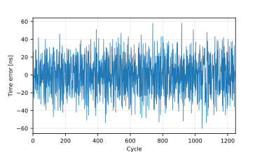
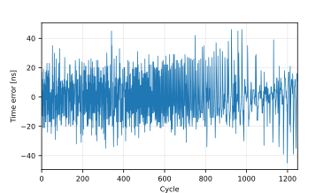

*Accurate time synchronization in low-energy, microcontroller based embedded systems is right here with the flexPTP library on our side.*


**flexPTP has been designed with low resource utilization in mind. The library can easily fit into 20K program and 10K data memory space with all features enabled. The library has been ported to and tested on ARM Cortex-M4 and Cortex-M7 based microcontrollers manufactured by several vendors (e.g. STM32F4xx, STM32F7xx, STM32H7xx, TM4C1294 etc.). According to simple measurements published in several papers of ours, with the help of the library even low-power systems achieved a synchronization precision of tens of nanoseconds.**

*The library is released under the MIT license with the endeavour to provide quick and compact solution for embedded time synchronization.*

## Features

flexPTP offers the following capabilities:

- [IEEE 1588](https://ieeexplore.ieee.org/document/9120376) compatible **slave** and **master** OC implementation
- supports **E2E** and **P2P** delay mechanisms
- supports **L2** and **L4** transport mechanisms
- supports **one-step** and **two-step** signaling modes
- can operate as a **IEEE 802.1AS** clock (slave or master)
- supports lwIP and EtherLib as underlying network stack
- features a rich set of runtime-configurable options
- features numerous logging features
- provides operational statistics
- provides means to compensate hardware layer delays
- provides **CMake-support**, compiles into a library
- provides a simple servo (controller) interface
- automatically cooperates with certain CLI terminals

> [!NOTE]
> **The full documentation is available [here](https://epagris.github.io/flexPTP/)!**

## Platforms and examples

The library package ships with hardware ports for several platforms, including:

- **TM4C1294** (_lwIP_)
  - Example: [EK-TM4C1294XL Connected LaunchPad flexPTP demo](https://github.com/epagris/flexPTP-demo-TM4C1294)
- **STM32F4xx** (_EtherLib_/_lwip_)
  - Example: [STM32 NUCLEO-F439ZI flexPTP demo](https://github.com/epagris/flexPTP-demo-NUCLEO-F439ZI)
- **STM32F7xx** (_EtherLib_/_lwip_)
  - Example: [STM32 NUCLEO-F746ZG flexPTP demo](https://github.com/epagris/flexPTP-demo-NUCLEO-F746ZG)
- **STM32H7xx** (_EtherLib_/_lwip_)
  - Example: [STM32 NUCLEO-H743ZI flexPTP demo](https://github.com/epagris/flexPTP-demo-NUCLEO-H743ZI), [STM32 **dual-core** NUCLEO-H745ZI-Q flexPTP demo](https://github.com/epagris/flexPTP-demo-NUCLEO-H745ZI-Q/)
- **MK64F**: (_lwip_)
  - Example: [NXP FRDM-K64F flexPTP demo](https://github.com/epagris/flexPTP-demo-FRDM-K64F)

## Requirements

Apart from the access to a working C compiler, only the following two criteria must be met to compile flexPTP:

- The library relies on the services of the [FreeRTOS](https://www.freertos.org/) embedded operating system thus it is required to integrate the library.
- A compatible network stack library and target platform Ethernet driver is required. Currently [Lightweight IP](https://github.com/lwip-tcpip/lwip) (lwip) and [EtherLib](https://gitea.epagris.com/epagris/EtherLib) are supported.

## Porting and options

For elaborate information on porting and options refer to [Porting and configuration](https://epagris.github.io/flexPTP/porting.html).

### Network stack requirements

The network stack (lwIP or EtherLib) must provide tools to communicate receive and transmit timestamps along the PTP messages. It's the developers responsibility to make the timestamps captured in the hardware available to the flexPTP module.

For better understading how timestamps are fed into flexPTP, refer to [ptp_receive_enqueue()](https://epagris.github.io/flexPTP/task__ptp_8c.html#a73b5e9841da53dee4d9230d8a418b2ac) in [task_ptp.c](https://epagris.github.io/flexPTP/task__ptp_8c.html).

#### lwIP

The lwIP (up to v2.2.0) is not designed for support timestamp propagation right away. A possible workaround is the extension of the `pbuf` structure so that it can carry the timestamps and the usual packet data as well through defining the `LWIP_PBUF_CUSTOM_DATA` macro.

~~~~~~~~~~~~~~~~~~~~~~~~~~~~~~~~~~~{c}
// Main packet buffer struct
struct pbuf {
  /* ... */

  // Contents of LWIP_PBUF_CUSTOM_DATA>>
  /* PTP timestamp fields */
  u32_t time_s, time_ns;

  /* Transmit callback function */
  void (*tx_cb)(struct pbuf * pPbuf);
  // <<Contents of LWIP_PBUF_CUSTOM_DATA
};
~~~~~~~~~~~~~~~~~~~~~~~~~~~~~~~~~~~

The low level lwIP-Ethernet driver must be instrumented to communicate receive and transmit timestamps. Fortunately, developing such an extension is not that difficult, at all. As an example you can find a guide [here](https://epagris.github.io/flexPTP/_h743_ethernetif_modifications.html) that showcases our amendments to the vendor-provided `ethernetif.c` low level lwIP Ethernet driver file for the STM32H743 platform. You can also find examples on PTP-compatible lwip low-level drivers among the [example projects](#platforms-and-examples).

#### EtherLib

EtherLib provides immediate support for passing timestamp with packet data. For more information, visit the [EtherLib repository](https://gitea.epagris.com/epagris/EtherLib).


### Compile-time options

The flexPTP library expects hardware constants and parameters as well as default settings passed in a `flexptp_options.h` header file.

## Building

The preferred and encouraged way to compile the library is to harness the built-in CMake support, although, building using any IDE is possible. The only requirement is a working a C (cross-)compiler (e.g. `arm-none-eabi-gcc`). More, detailed description on this topic: [Compiling the library](https://epagris.github.io/flexPTP/building.html).

## Usage

### Startup and shutdown

The flexPTP module can be started/stopped by calling [reg_task_ptp()](https://epagris.github.io/flexPTP/task__ptp_8c.html#a2d483d3c32b3890d8c699018e48e45cd)/[unreg_task_ptp](https://epagris.github.io/flexPTP/task__ptp_8c.html#a5fd98059e4c2ec1004c74064e17cbe4c).

### Runtime operation

The library has an extensive interface for manipulating the PTP operation mode during runtime (e.g. change profile, enable logging etc.), learn more [here](https://epagris.github.io/flexPTP/project_organization.html). The flexPTP includes a CLI interface as well, if a suitable CLI library is given, flexPTP offers the following multitude of CLI commands:

```
ptp servo params [Kp Kd]                           Set or query K_p and K_d servo parameters
ptp servo log internals {on|off}                   Enable or disable logging of servo internals
ptp reset                                          Reset PTP subsystem
ptp servo offset [offset_ns]                       Set or query clock offset
ptp log {def|corr|ts|info|locked|bmca} {on|off}    Turn on or off logging
time [ns]                                          Print time
ptp master [[un]prefer] [clockid]                  Master clock settings
ptp info                                           Print PTP info
ptp domain [domain]                                Print or set PTP domain
ptp addend [addend]                                Print or set addend
ptp transport [{ipv4|802.3}]                       Set or get PTP transport layer
ptp delmech [{e2e|p2p}]                            Set or get PTP delay mechanism
ptp transpec [{def|gPTP}]                          Set or get PTP transportSpecific field (majorSdoId)
ptp profile [preset [<name>]]                      Print or set PTP profile, or list available presets
ptp tlv [preset [name]|unload]                     Print or set TLV-chain, or list available TLV presets
ptp pflags [<flags>]                               Print or set profile flags
ptp period <delreq|sync|ann> [<lp>|matched]        Print or set log. periods
ptp coarse [threshold]                             Print or set coarse correction threshold
ptp priority [<p1> <p2>]                           Print or set clock priority fields
```
The library can load a previously stored or save the current configuration from and to a non-volatile storage with the help of some glue code.

## Performance measurements

Our library achieves decent synchronization performance, usually **better than 100ns timing precision** even on low-power microcontrollers. The below measurements were made using the nowadays common gPTP (802.1AS) profile. Logs corresponding to each plot are located [here](manual/dumps/).

|                     TM4C1294                     |                     STM32F407                      |                     STM32H743                      |
| :----------------------------------------------: | :------------------------------------------------: | :------------------------------------------------: |
|  |  |  |

## Related papers

[Time Synchronization Extension for the IO-Link Industrial Communication Protocol](https://ieeexplore.ieee.org/document/10747727)

[Distributed Measurement System for Performance Evaluation of Embedded Clock Synchronization Solutions](https://ieeexplore.ieee.org/document/9805958/)

[Portable, PTP-based Clock Synchronization Implementation for Microcontroller-based Systems and its Performance Evaluation](https://ieeexplore.ieee.org/document/9615250)

[Synchronization of Sampling in a Distributed Audio Frequency Range Data Acquisition System Utilizing Microcontrollers](https://ieeexplore.ieee.org/document/9918455/)

[Methods of Peripheral Synchronization in Real-Time Cyber-Physical Systems](https://ieeexplore.ieee.org/document/10178979/)

## Maintainers, contributors

- András Wiesner ([Epagris](https://github.com/epagris))
- Tamás Kovácsházy ([khazy](https://github.com/khazy))

## Licensing

The flexPTP library has been released under the MIT license.
